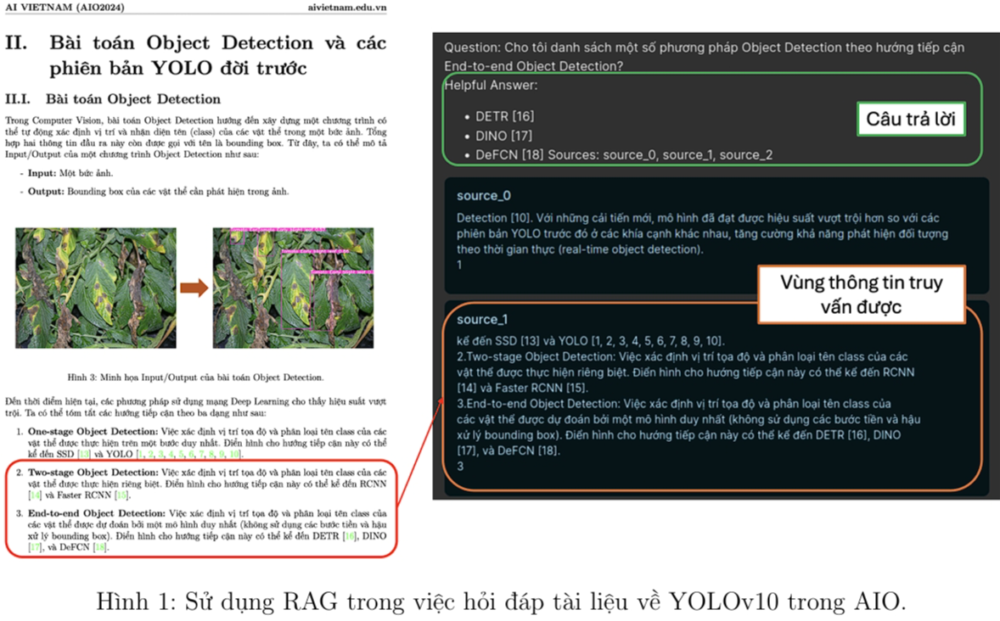
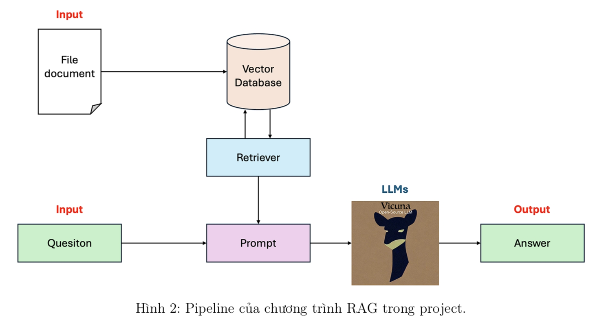
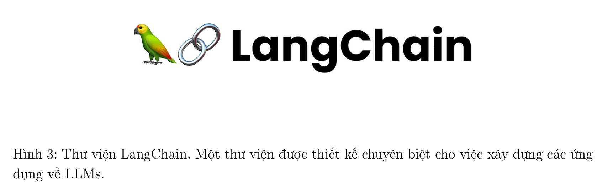
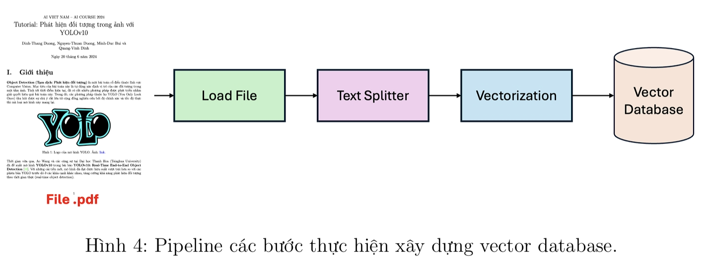
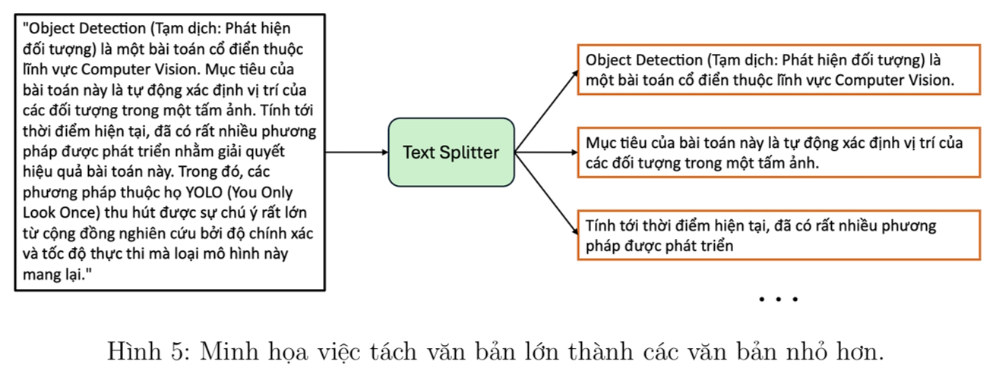
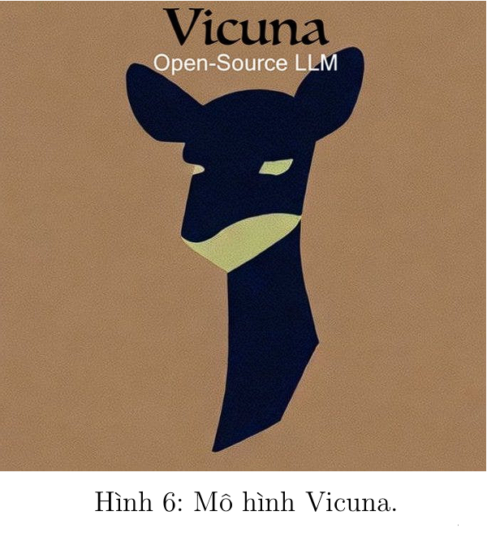
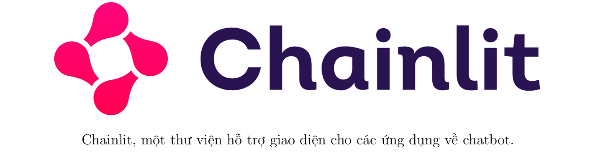
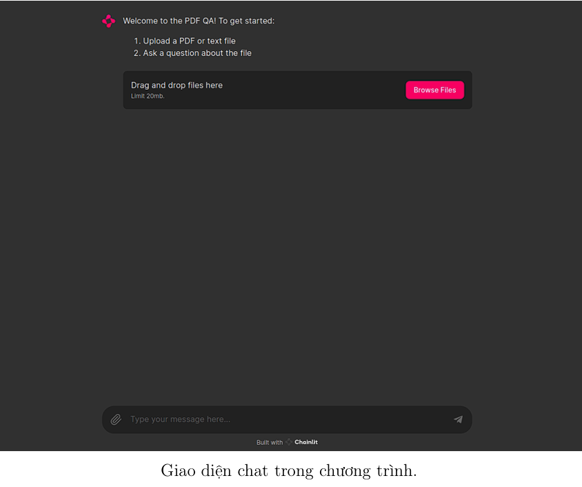
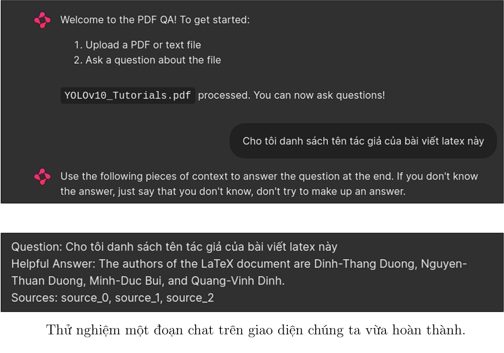

# RAG on PDF Q&A using LLM
Ứng dụng RAG trong việc hỏi đáp tài liệu bài  học AIO (một khóa học toàn diện về AI)

## I. Giới thiệu
Large Language Models (LLMs) (Tạm dịch: Các mô hình ngôn ngữ lớn) là loại mô
hình cho phép người dùng nhập vào một văn bản với nội dung bất kì, thường sẽ là các yêu cầu
hoặc câu hỏi. Từ đó, mô hình sẽ trả về câu trả lời dưới dạng văn bản thỏa mãn yêu cầu của
người dùng. Các ứng dụng phổ biến nhất về LLMs có thể kể đến như ChatGPT, Gemini...



Trong LLMs, **Retrieval Augmented Generation (RAG)** là một kỹ thuật giúp LLMs cải
thiện chất lượng kết quả tạo sinh bằng cách tích hợp nội dung truy vấn được từ một nguồn tài
liệu nào đó để trả lời cho một câu hỏi đầu vào. Trong project này, chúng ta sẽ tìm hiểu cách xây
dựng một chương trình RAG cơ bản. Đồng thời, ứng dụng chương trình vào việc hỏi đáp tài liệu
bài học trong khóa AIO. Theo đó, Input và Output của chương trình là:
- Input: File tài liệu cần hỏi đáp và một câu hỏi liên quan đến nội dung tài liệu.
- Output: Câu trả lời.

Tổng quan, luồng xử lý (pipeline) của chương trình RAG mà chúng ta sẽ xây dựng có dạng như
sau:



## II. Cài đặt chương trình
Trong phần này, chúng ta sẽ tìm hiểu cách cài đặt chương trình RAG theo như mô tả ở phần 
trước, bao gồm phần chương trình RAG và phần giao diện chat (optional).Cả hai phần đều sẽ 
được thực hiện trên Google Colab đã được kích hoạt GPU. <span style='color:red'> Lưu ý rằng, 
mục tiêu của project này hướng đến việc hiểu được một số khái niệm cơ bản về bài toán RAG 
trong AI. Vì vậy, các bạn có thể tạm thời không cần hiểu rõ các chức năng của các hàm, kỹ 
thuật sẽ được sử dụng trong bài. </span>

### 1. Chương trình RAG:
Trước tiên, chúng ta cần nắm được các bước xử lý cơ bản trong RAG bằng cách xây dựng một
chương trình RAG đơn giản. Tại đây, ta sẽ sử dụng thư viện LangChain để thực hiện việc này.
Các bước triển khai như sau:



#### 1.1. Cài đặt các gói thư viện cần thiết:
Thực hiện cài đặt một số gói thư viện thông qua lệnh pip install như sau:

```
!pip install -q transformers==4.41.2
!pip install -q bitsandbytes==0.43.1
!pip install -q accelerate==0.31.0
!pip install -q langchain==0.2.5
!pip install -q langchainhub==0.1.20
!pip install -q langchain-chroma==0.1.1
!pip install -q langchain-community==0.2.5
!pip install -q langchain_huggingface==0.0.3
!pip install -q python-dotenv==1.0.1
!pip install -q pypdf==4.2.0
!pip install -q numpy==1.24.4
```

#### 1.2. Xây dựng vector database:
Để thực hiện truy vấn, chúng ta cần phải có một cơ sở dữ liệu. Theo như nội 
dung project, với dữ liệu nguồn là một file pdf, chúng ta sẽ thực hiện đưa các 
nội dung trong file này vào cơ sở dữ liệu. Về các bước thực hiện, các bạn có 
thể coi qua ảnh sau:



- **Import các thư viện cần thiết:** Để xây dựng vector database, chúng ta cần một
số thư viện sau:

    ```
    import torch

    from transformers import BitsAndBytesConfig
    from transformers import AutoTokenizer, AutoModelForCausalLM, pipeline
    from langchain_huggingface import HuggingFaceEmbeddings
    from langchain_huggingface.llms import HuggingFacePipeline

    from langchain. memory import ConversationBufferMemory
    from langchain_community.chat_message_histories import ChatMessageHistory
    from langchain_community.document_loaders import PyPDFLoader, TextLoader
    from langchain. chains import ConversationalRetrievalChain

    from langchain_chroma import Chroma
    from langchain_text_splitters import RecursiveCharacterTextSplitter
    from langchain_core.runnables import RunnablePassthrough
    from langchain_core.output_parsers import StrOutputParser
    from langchain import hub
    ```

- **Đọc file pdf:** Từ một file pdf cho trước (trong bài này ta sẽ sử dụng file mô tả
là bài hướng dẫn YOLOv10, các bạn có thể tải file này tại [đây](https://drive.google.com/file/d/1lWuq0COKnU9mCfMvTEq54DBLgAh3yYDx/view?usp=drive_link)), ta sử dụng class
PyPDFLoader để đọc file pdf này lên như sau:

    ```
    Loader = PyPDFLoader
    FILE_PATH = '/content/YOLOv10_Tutorials.pdf'
    loader = Loader(FILE_PATH)
    documents = loader.load()
    ```

- **Khởi tạo bộ tách văn bản (text splitter):** Hầu hết các trường hợp, vùng thông
tin mà chúng ta cần chỉ là một câu nào đó trong file văn bản lớn. Vì vậy, sẽ tốt hơn
nếu chúng ta tách file văn bản ra thành các đoạn văn bản nhỏ, và mỗi văn bản nhỏ
này ta sẽ coi như là một tài liệu trong cơ sở dữ liệu. Dựa vào ý tưởng trên, ta sẽ sử
dụng class Text Splitter để thực hiện tác vụ trên. Ở đây, ta khai báo instance text
splitter như sau:

    `text_splitter = RecursiveCharacterTextSplitter(chunk_size=1000, chunk_overlap=100)`

    Với text_splitter, ta thực hiện tách file pdf:

    ```
    docs = text_splitter.split_documents(documents)

    print("Number of sub-documents: ", len(docs))
    print(docs[0])
    ```

    Ở hai dòng print trên, ta in số lượng tài liệu sau khi tách khỏi pdf và in nội dung tài
    liệu đầu tiên.

    

- **Khởi tạo instance vectorization:** Các văn bản gốc được biểu diễn dưới dạng string.
Nếu giữ dạng biểu diễn này, việc truy vấn sẽ gặp khó khăn và kết quả truy vấn không
được chính xác. Để khắc phục việc này, chúng ta có thể thực hiện chuyển đổi các văn
bản thành các vector. Trong file notebook, ta chạy đoạn code sau:

    `embedding = HuggingFaceEmbeddings()`

    embedding instance sẽ giúp chúng ta thực hiện việc chuyển đổi văn bản thành vector.

- **Khởi tạo vector database:** Với các thông tin về danh sách các documents từ kết
quả text_splitter và object dùng để vectorization embedding, ta sẽ đưa vào hàm dùng
để khởi tạo vector database như sau:

    ```
    vector_db = Chroma.from_documents(documents=docs, embedding=embedding)
    retriever = vector_db.as_retriever()
    ```

    Ta có thể thử thực hiện truy vấn với một đoạn văn bản bất kì tại đây:

    ```
    result = retriever.invoke("What is YOLO?")
    print("Number of relevant documents: ", len(result))
    ```

    Kết quả của đoạn code trên sẽ trả về cho ta danh sách các tài liệu có liên quan đến
    đoạn văn bản đầu vào.

#### 1.3. Khởi tạo mô hình ngôn ngữ lớn: 
Trong project này, ta sẽ sử dụng mô hình Vicuna,
một mô hình ngôn ngữ lớn nguồn mở có hiệu suất rất ổn, có thể phản hồi tốt với tiếng
Việt. Các bạn có thể đọc thêm về mô hình Vicuna tại [đây](https://lmsys.org/blog/2023-03-30-vicuna/).

<p align='center'>  </p>

Một vấn đề của mô hình ngôn ngữ lớn đó là nó yêu cầu tài nguyên về phần cứng khá lớn.
Vì vậy, để khởi tạo được mô hình Vicuna trên Colab, chúng ta sẽ cần thực hiện một số
bước sau:

- **Khai báo một số cài đặt cần thiết cho mô hình:**
    ```
    nf4_config = BitsAndBytesConfig(load_in_4bit=True,
                                    bnb_4bit_quant_type="nf4",
                                    bnb_4bit_use_double_quant=True,
                                    bnb_4bit_compute_dtype=torch.bfloat16)
    ```

- **Khởi tạo mô hình và tokenizer:**
    ```
    MODEL_NAME = "lmsys/vicuna-7b-v1.5"

    model = AutoModelForCausalLM.from_pretrained(MODEL_NAME,
                                                quantization_config=nf4_config,
                                                low_cpu_mem_usage=True)

    tokenizer = AutoTokenizer.from_pretrained(MODEL_NAME)
    ```

- **Tích hợp tokenizer và model thành một pipeline để tiện sử dụng:**
    ```
    model_pipeline = pipeline("text-generation",
                            model=model,
                            tokenizer=tokenizer,
                            max_new_tokens=512,
                            pad_token_id=tokenizer.eos_token_id,
                            device_map="auto")

    llm = HuggingFacePipeline(pipeline=model_pipeline)
    ```

#### 1.4. Chạy chương trình:
Với vector database, retriever và mô hình Vicuna đã hoàn thiện. Ta
sẽ kết hợp chúng lại để hoàn thành chương trình RAG đầu tiên của mình. Các bạn có thể
test thử bằng cách đặt các câu hỏi có liên quan đến file tài liệu, câu trả lời của mô hình sẽ
nằm ở phần "Answer:" trong output.

```
prompt = hub.pull("rlm/rag-prompt")

def format_docs(docs):
    return "\n\n".join(doc.page_content for doc in docs)

rag_chain = (
            {"context": retriever | format_docs, "question": RunnablePassthrough()}
            | prompt
            | llm
            | StrOutputParser()
)

USER_QUESTION = "YOLOv10 là gì?"
output = rag_chain.invoke(USER_QUESTION)
answer = output.split('Answer:')[1].strip()
print(answer)
```

Như vậy, chúng ta đã hoàn thành một chương trình Python về RAG, có khả năng hỏi đáp
các nội dung trong một file pdf.

### 2. Xây dựng giao diện chat:
Sau khi có chương trình RAG có thể trả về output đúng như dự định, ta có thể tích hợp vào
với một giao diện chat để có được một ứng dụng chat hoàn chỉnh. Để xây dựng phần giao diện
trong project này, chúng ta sẽ sử dụng thư viện Chainlit. Lưu ý rằng, phần code Chainlit có sử
dụng những đoạn code Python phức tạp, các bạn mới chỉ cần xem và chạy dưới dạng blackbox.

<p align='center'>  </p>

Các bước thực hiện như sau:

#### 2.1. Tải các gói thư viện:
```
!pip install -q transformers == 4.41.2
!pip install -q bitsandbytes == 0.43.1
!pip install -q accelerate == 0.31.0
!pip install -q langchain == 0.2.5
!pip install -q langchainhub == 0.1.20
!pip install -q langchain-chroma == 0.1.1
!pip install -q langchain-community == 0.2.5
!pip install -q langchain-openai == 0.1.9
!pip install -q langchain_huggingface == 0.0.3
!pip install -q chainlit == 1.1.304
!pip install -q python-dotenv == 1.0.1
!pip install -q pypdf == 4.2.0
!npm install -g localtunnel
!pip install -q numpy == 1.24.4
```

#### 2.2. Import các gói thư viện cần thiết:
```
import chainlit as cl
import torch

from chainlit.types import AskFileResponse

from transformers import BitsAndBytesConfig
from transformers import AutoTokenizer, AutoModelForCausalLM, pipeline
from langchain_huggingface.llms import HuggingFacePipeline
from langchain.memory import ConversationBufferMemory
from langchain_community.chat_message_histories import ChatMessageHistory
from langchain.chains import ConversationalRetrievalChain
 
from langchain_huggingface import HuggingFaceEmbeddings
from langchain_chroma import Chroma
from langchain_community.document_loaders import PyPDFLoader, TextLoader
from langchain_text_splitters import RecursiveCharacterTextSplitter
from langchain_core.runnables import RunnablePassthrough
from langchain_core.output_parsers import StrOutputParser
from langchain import hub
```

#### 2.3. Cài đặt lại các hàm và instance ở file trước:
Chúng ta khai báo lại một số hàm và
instance ở phần trước. Các bạn có thể quay lại mục trước để xem phần giải thích:

```
text_splitter = RecursiveCharacterTextSplitter(chunk_size=1000, chunk_overlap=100)
embedding = HuggingFaceEmbeddings()
```

#### 2.4. Xây dựng hàm xử lý file input đầu vào:
Để thuận tiện trong việc cài đặt, ta gom việc đọc và tách văn bản vào chung một hàm như sau:

```
def process_file(file: AskFileResponse):
    if file.type == "text/plain":
        Loader = TextLoader
    elif file.type == "application/pdf":
        Loader = PyPDFLoader

    loader = Loader(file.path)
    documents = loader.load()
    docs = text_splitter.split_documents(documents)
    for i, doc in enumerate(docs):
        doc.metadata["source"] = f"source_{i}"
    return docs
```

#### 2.5. Xây dựng hàm khởi tạo Chroma database:
Tương tự phía trên, ta xây dựng hàm khởi tạo vector database cho phần cài đặt này:

```
def get_vector_db(file: AskFileResponse):
    docs = process_file(file)
    cl.user_session.set("docs", docs)
    vector_db = Chroma.from_documents(documents=docs, embedding=embedding)
    return vector_db
```

Tại line 2, gọi hàm process_file() để xử lý file input và trả về các tài liệu nhỏ (docs). Sau
đó, khởi tạo Chroma vector database bằng cách gọi Chroma.from_documents() và truyền vào
docs cũng như embedding đã khởi tạo trước đó.

#### 2.6. Khởi tạo mô hình ngôn ngữ lớn:

```
def get_huggingface_llm(model_name: str = "lmsys/vicuna-7b-v1.5", max_new_token: int = 512):
    nf4_config = BitsAndBytesConfig(
        load_in_4bit=True,
        bnb_4bit_quant_type="nf4",
        bnb_4bit_use_double_quant=True,
        bnb_4bit_compute_dtype=torch.bfloat16
    )

    model = AutoModelForCausalLM.from_pretrained(
        model_name,
        quantization_config=nf4_config,
        low_cpu_mem_usage=True
    )

    tokenizer = AutoTokenizer.from_pretrained(model_name)

    model_pipeline = pipeline(
        "text-generation",
        model=model,
        tokenizer=tokenizer,
        max_new_tokens=max_new_token,
        pad_token_id=tokenizer.eos_token_id,
        device_map="auto"
    )

    llm = HuggingFacePipeline(pipeline=model_pipeline)

    return llm

LLM = get_huggingface_llm()
```

#### 2.7. Khởi tạo welcome message:
```
welcome_message = """Welcome to the PDF QA! To get started:
                    1. Upload a PDF or text file
                    2. Ask a question about the file
"""
```

#### 2.8. Khởi tạo hàm on_chat_start:
```
@cl.on_chat_start
async def on_chat_start():
    files = None
    while files is None:
        files = await cl.AskFileMessage(
            content=welcome_message,
            accept=["text/plain", "application/pdf"],
            max_size_mb=20,
            timeout=180
        ).send()
    file = files[0]

    msg = cl.Message(content=f"Processing '{file.name}'...",
        disable_feedback=True)

    await msg.send()

    vector_db = await cl.make_async(get_vector_db)(file)

    message_history = ChatMessageHistory()
    memory = ConversationBufferMemory(
        memory_key="chat_history",
        output_key="answer",
        chat_memory=message_history,
        return_messages=True
    )
    retriever = vector_db.as_retriever(search_type="mmr",
                                    search_kwargs={'k': 3})

    chain = ConversationalRetrievalChain.from_llm(
        llm=LLM,
        chain_type="stuff",
        retriever=retriever,
        memory=memory,
        return_source_documents=True
    )

    msg.content = f"'{file.name}' processed. You can now ask questions!"
    await msg.update()

    cl.user_session.set("chain", chain)
```

#### 2.9. Khởi tạo hàm on_message:
```
@cl.on_message
async def on_message(message: cl.Message):
    chain = cl.user_session.get("chain")
    cb = cl.AsyncLangchainCallbackHandler()
    res = await chain.ainvoke(message.content, callbacks=[cb])
    answer = res["answer"]
    source_documents = res["source_documents"]
    text_elements = []

    if source_documents:
        for source_idx, source_doc in enumerate(source_documents):
            source_name = f"source_{source_idx}"
            text_elements.append(
                cl.Text(content=source_doc.page_content, name=source_name)
            )
        source_names = [text_el.name for text_el in text_elements]

    if source_names:
        answer += f"\nSources: {', '.join(source_names)}"
    else:
        answer += "\nNo sources found"

    await cl.Message(content=answer, elements=text_elements).send()
```

#### 2.10. Chạy chainlit app:
`!chainlit run app.py --host 0.0.0.0 --port 8000 &>/content/logs.txt &`

#### 2.11. Expose local host thành public host bằng local tunnel:

```
import urllib
print("Password/Enpoint IP for localtunnel is:",urllib.request.urlopen(
    'https://ipv4.icanhazip.com').read().decode('utf8').strip("\n"))
!lt --port 8000 --subdomain aivn-simple-rag
```

Khi chạy xong các bước trên, các bạn truy cập vào đường dẫn tạm localtunnel, nhập
password được cung cấp để truy cập vào giao diện web. Lưu ý rằng, phương án sử dụng
localtunnel là một phương án truy cập vào localhost trên Colab đơn giản nhưng có thể có
lúc không hoạt động được. Nếu có máy tính có GPU, các bạn có thể đưa code này chạy ở
máy để tiện sử dụng và đảm bảo đầu ra hơn.



<br/>


